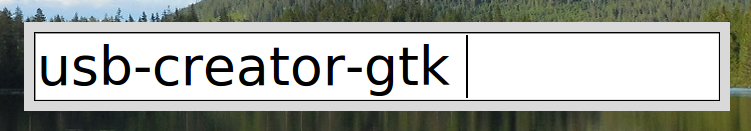

Launchbox
=========

Command launcher with tab completion and full shell commands

Launchbox opens a text box in the center of the screen where you can
type a command line which will be run in your shell. Tab and shift-tab
can be used to cycle through tab completions.

Launchbox looks for the enviromnent variable ``$SHELL``. If this is
not found it will use ``/bin/sh``. It traverses the shell's ``$PATH``
variable to find commands for tab completion.

Usage
-----

Tkinter::

    launchbox

Gtk 2 (doesn't work yet)::

    lauchbox --gtk2

A port to Gtk+ 3 is almost complete.

Requirements
------------

Python 3.6 or higher and Tkinter or pygtk.

Git Repository
--------------

http://github.com/olemb/launchbox/

Keys
----

tab
  cycle through tab completions

shift-tab
  cycle backwards

shift-backspace
  delete all text

ctrl-backspace
  delete word for word (Gtk only)

enter
  run command

escape
  close window

License
-------

Launchbox is released under the terms of the `MIT license
<http://en.wikipedia.org/wiki/MIT_License>`_.

Contact
-------

Ole Martin Bjorndalen - ombdalen@gmail.com
